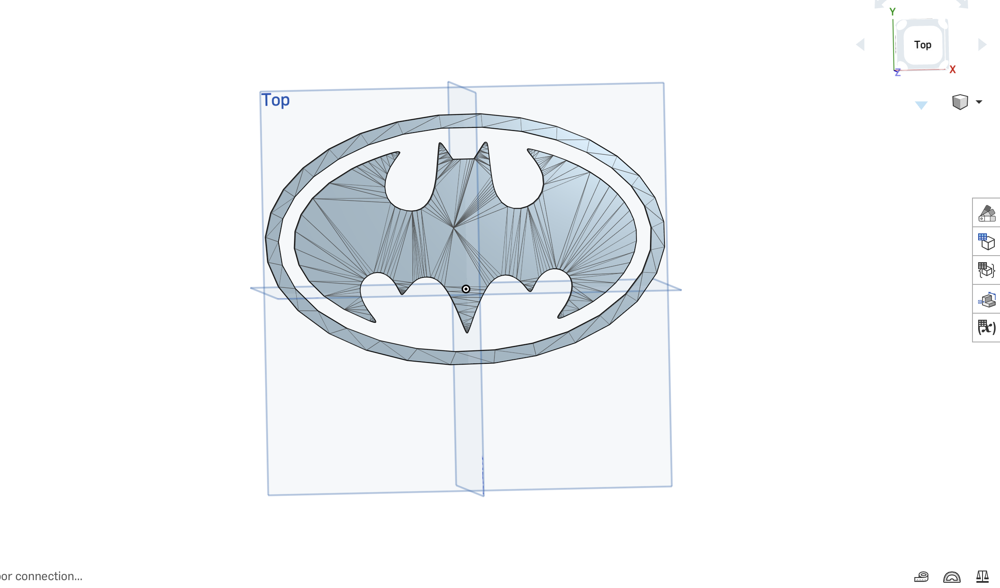

# OnShape Batman Logo Design

A custom 2D/3D Batman logo modeled using OnShape. This project showcases precise sketching, constraints, and extrusion workflows to recreate the iconic dark knight emblem.

## View the Design

Click the image below to open the interactive 3D model directly in OnShape:

## Features & Techniques Used
* **Symmetrical Sketching:** Utilizing mirror constraints to ensure perfect balance across the vertical axis.
* **Spline & Arc Tools:** Smooth curvature matching the classic comic/movie proportions.
* **Extrusion:** Clean 3D depth mapping for a solid, manufacturable finish.

## How to Use
1. Click the preview image above to view the public OnShape document.
2. If you want to modify or build upon this design, sign in to your OnShape account and click **Make a Copy** to create an editable version in your workspace.